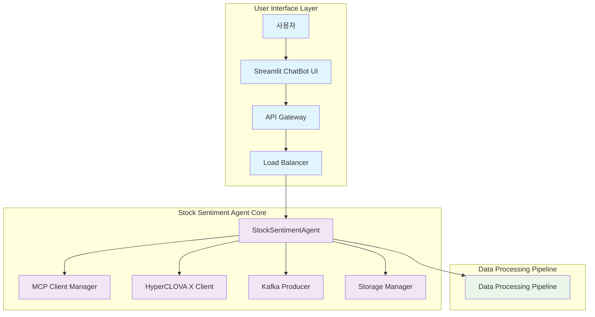
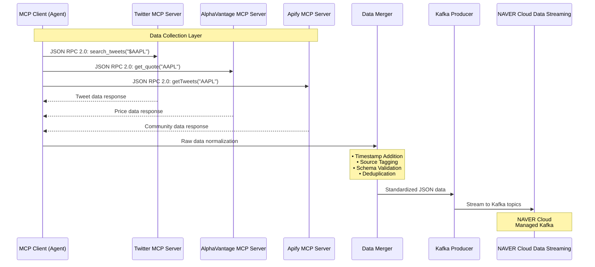
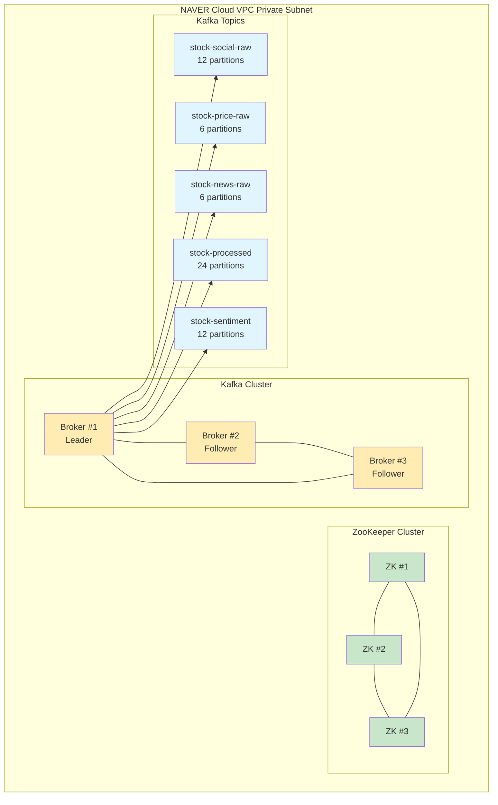
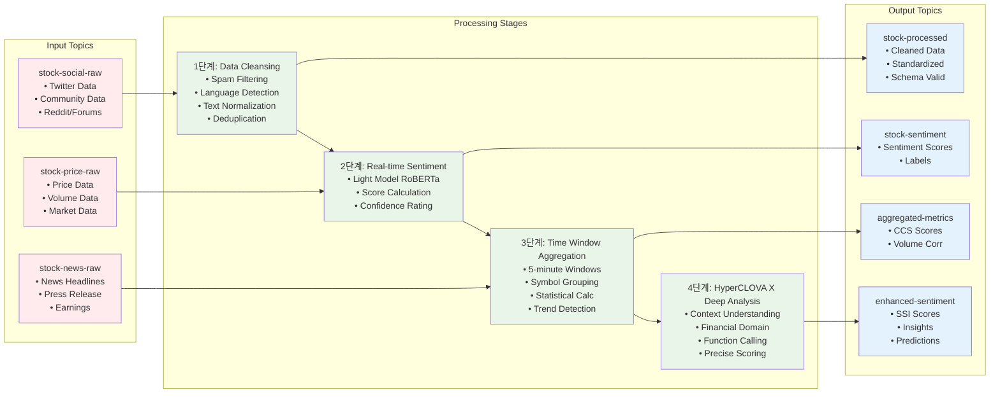
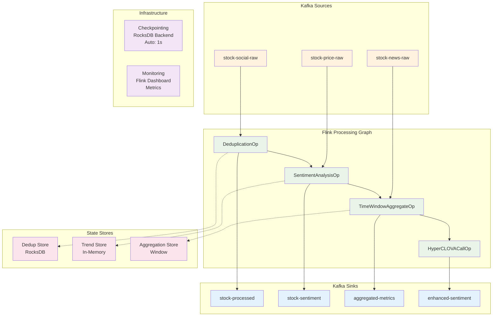
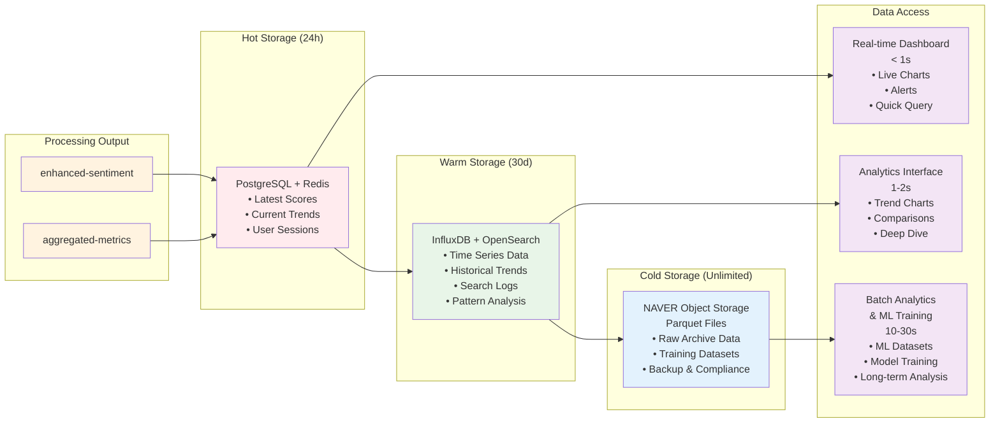
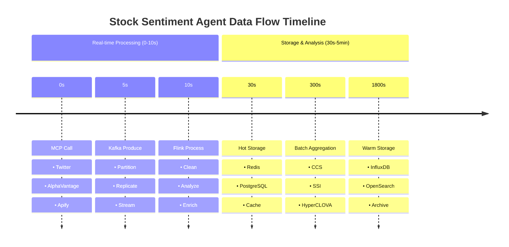
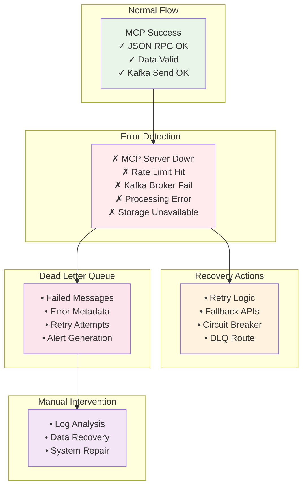
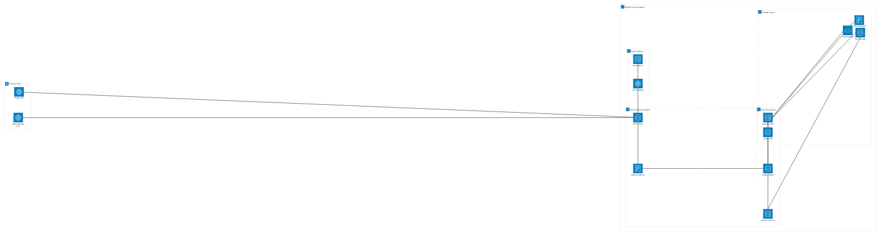

# Stock Sentiment Agent 전체 데이터 흐름도 및 아키텍처 Mermaid 시각화

## 1. 전체 시스템 아키텍처 개요




## 2. MCP JSON RPC → Kafka 데이터 수집 흐름




## 3. NAVER Cloud Data Streaming Kafka 아키텍처




## 4. 데이터 가공 파이프라인 흐름




## 5. Apache Flink Stream Processing 토폴로지




## 6. 3계층 저장소 구조 및 데이터 흐름




## 7. Vector Storage와 RAG 파이프라인

```mermaid
graph TB
    subgraph "Text Processing"
        TP1[Processed Text Data<br/>• Tweets<br/>• News<br/>• Comments]
        TP2[HyperCLOVA X<br/>Embedding API<br/>• text → vector<br/>• 768 dimensions<br/>• Batch Process]
    end
    
    subgraph "Vector Storage"
        VS1[Milvus DB<br/>• Tweet Embeddings<br/>• News Embeddings<br/>• Context Metadata]
        VS2[Index Structure<br/>• IVF_FLAT Index<br/>• COSINE Similarity<br/>• 1M+ Vectors<br/>• Auto Scaling]
    end
    
    subgraph "RAG Query"
        RQ1[User Query<br/>"AAPL 감정은?"]
        RQ2[HyperCLOVA X<br/>Chat API<br/>Query + Context<br/>→ Answer]
    end
    
    TP1 --> TP2
    TP2 --> VS1
    VS1 --> VS2
    
    RQ1 --> VS1
    VS1 --> RQ2
    
    classDef text fill:#fff3e0
    classDef vector fill:#e8f5e8  
    classDef rag fill:#e3f2fd
    
    class TP1,TP2 text
    class VS1,VS2 vector
    class RQ1,RQ2 rag
```


## 8. 전체 시스템 타임라인 데이터 흐름




## 9. 에러 처리 및 복구 흐름




## 10. 전체 아키텍처 통합 다이어그램



